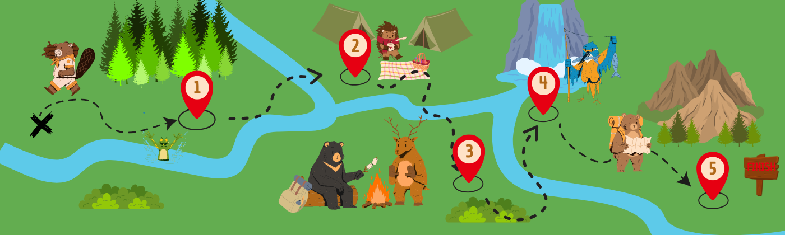

# Documentación Técnica del Proyecto en WPF

## Índice
1. [Introducción](#introducción)
2. [Diseño Aplicado](#diseño-aplicado)
3. [Controles Utilizados](#controles-utilizados)
4. [Lógica de Puntuación](#lógica-de-puntuación)
5. [Código Fuente](#código-fuente)

---

## Introducción
Este proyecto de WPF está diseñado para ofrecer una experiencia interactiva y atractiva para los usuarios. La aplicación está estructurada en diferentes pantallas y actividades que desafían a los jugadores a completar misiones para avanzar en la historia.

---

## Diseño Aplicado
El diseño de la aplicación es visualmente atractivo y está pensado para motivar a los usuarios a seguir jugando hasta completar la aplicación. Los puntos destacados del diseño son:
- **Desbloqueo por Misiones:** Cada etapa del juego requiere completar misiones (preguntas) para avanzar.

- **Personaje Guía:** Un personaje interactivo presenta la aventura mediante diálogos y acompaña al jugador a lo largo de la experiencia.

- **Imágenes Diseñadas a Mano:** Incluye:
  - Fondo de la aplicación.
  - Personajes que aparecen en las preguntas.
  - Un explorador como guía del juego.

  

- **Estilos Personalizados:** Cada control tiene uno o más estilos diseñados a mano para mantener una estética uniforme y atractiva.

La aplicación también cuenta con un **logo personalizado** que refuerza la identidad visual del proyecto.

---

## Controles Utilizados
La aplicación utiliza una combinación de controles para proporcionar una experiencia agradable, aqui tienes solo algunos de ellos:
- **Button:** Para la navegación y selección de respuestas.
- **Textblock/textBox:** Para mostrar preguntas y puntuaciones.
- **Imágenes (Image):** Para ilustrar preguntas y fondos.
- **Contenedores:** Para organizar los elementos visuales en las pantallas.
- **RadioButton, Checkbox, DragAndDrop, ComboBox o Slider:** para los ejercicios.
- **Frame:** Para organizar las preguntas.
- **StoryBoards:** Para la animación final.

---

## Lógica de Puntuación
La lógica de puntuación está implementada en una clase dedicada llamada `Puntuación`. La estructura de las actividades es la siguiente:
- Cada actividad contiene dos ejercicios: `Ejerciciox_Pregunta1` y `Ejerciciox_Pregunta2`.
- Cada ejercicio tiene un valor de **1 punto**.
- La puntuación total se actualiza dinámicamente con un método y se muestra al usuario al final del ejercicio y en la pantalla principal.

**Restricciones:** La aplicación limita las acciones del usuario para evitar errores y garantizar una experiencia fluida.

---

## Código Fuente
El código fuente está dividido en módulos bien estructurados que representan cada una de las funcionalidades de la aplicación. A continuación, se incluye el índice de los archivos de código:
1. `MainWindow.xaml` y `MainWindow.xaml.cs` - Pantalla principal.
2. `Pantalla_Celebración.xaml` y `Pantalla_Celebración.xaml.cs` - Pantalla de finalización.
3. `Puntuación.cs` - Lógica de puntuación.
4. `EjercicioX.xaml` y `EjercicioX.xaml.cs` - Ejercicios con 2 preguntas dentro, cada uno en una carpeta.
6. `Estilos.xaml` - Archivo con los estilos personalizados.
7. Jerarquía de carpetas para la organización.
---

