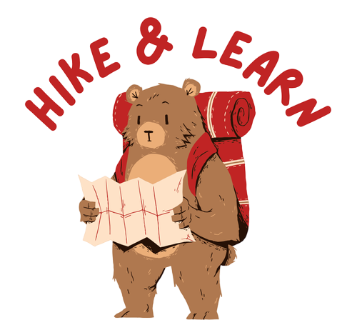
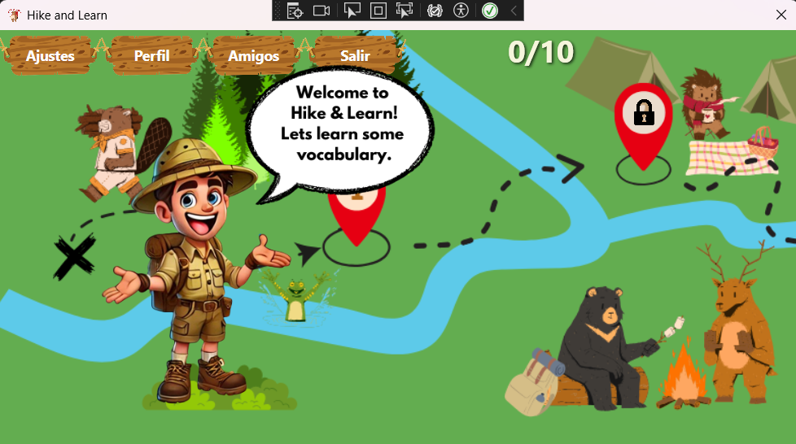
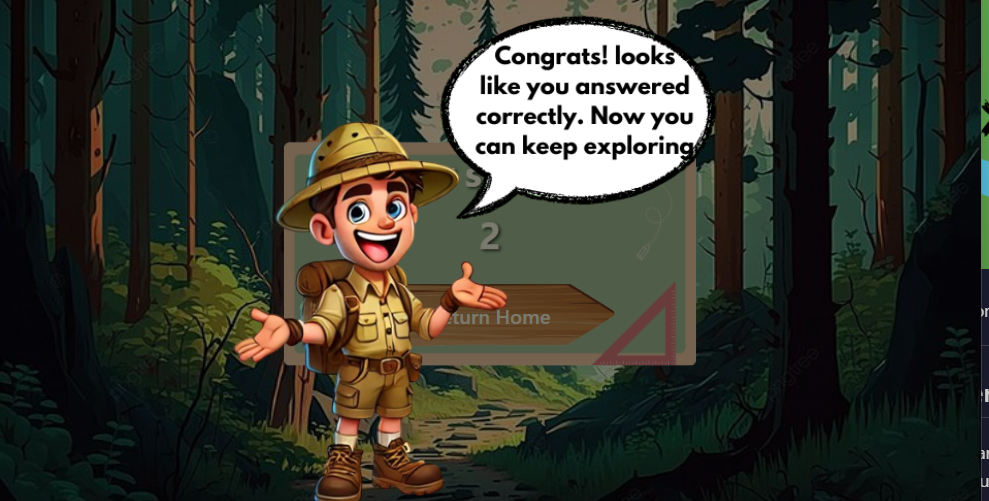
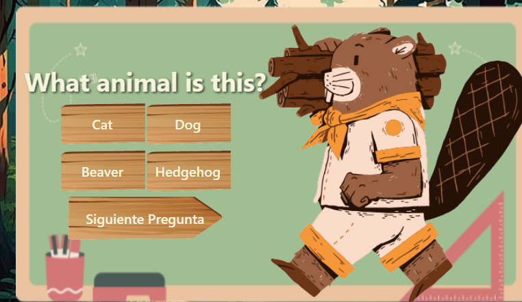
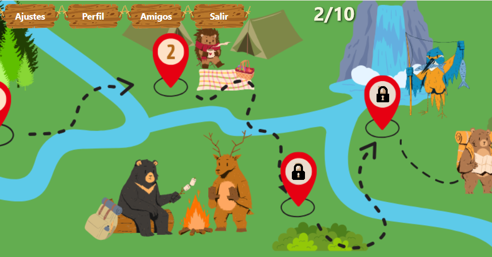
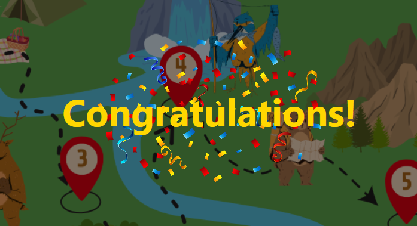

# Documentación de Usuario

Bienvenido al minicurso interactivo. A continuación, encontrarás una guía detallada sobre cómo moverte por cada una de las pantallas, junto con capturas de pantalla y explicaciones para aprovechar al máximo la experiencia.

## Índice
1. [Inicio del Juego](#inicio-del-juego)
2. [Interacción con el Explorador](#interacción-con-el-explorador)
3. [Resolviendo Preguntas](#resolviendo-preguntas)
4. [Avance en el Mapa](#avance-en-el-mapa)
5. [Finalización del Juego](#finalización-del-juego)

---

## Inicio del Juego
Cuando inicies el minicurso, serás recibido con una pantalla de bienvenida. Aquí encontrarás un botón para comenzar tu aventura.

Presiona el botón para comenzar tu recorrido por el mapa.

---

## Interacción con el Explorador
A lo largo del camino, un explorador te dará consejos útiles para avanzar en tu aventura. **Escucha atentamente sus mensajes**.

Para avanzar, **haz clic en la pantalla** después de que aparezca un diálogo o una imagen.

---

## Resolviendo Preguntas
Durante el curso, te encontrarás con ejercicios que debes resolver para avanzar. Cada ejercicio tiene dos preguntas.

- **Regla principal:** Tienes que acertar **todas las preguntas a la vez**. Si fallas una, deberás repetir el ejercicio completo.

Responde correctamente para desbloquear el siguiente nivel.

---

## Avance en el Mapa
Para avanzar en el mapa, utiliza la **rueda del ratón**. Esto te permitirá desplazarte a través del recorrido interactivo.

Explora el camino y descubre nuevos personajes y situaciones. Cada paso del camino te llevará más cerca del final.

---

## Finalización del Juego
Cuando completes todas las preguntas correctamente, habrás llegado al final de la partida.

El juego se cerrará automáticamente una vez finalizado. ¡Gracias por participar y enhorabuena por completar el minicurso!

---

### Notas:
- Sigue el camino y presta atención a los consejos del explorador.
- Haz clic en la pantalla para avanzar después de cada diálogo o imagen.
- Si necesitas ayuda adicional, consulta esta guía nuevamente.

¡Buena suerte y disfruta de la experiencia interactiva!
